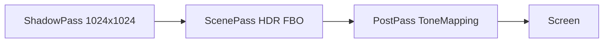

# MiniForwardRenderer（第 3 周作品）

面向游戏渲染校招的 **C++ / OpenGL 3.3** 前向渲染 Demo，对应 JD 中的光照、阴影、后处理与性能展示。

## 渲染管线



| Pass | 内容 |
|------|------|
| 1 Shadow | 光源正交投影深度图（Shadow Map） |
| 2 Scene | Blinn-Phong + 阴影采样 → 颜色 FBO |
| 3 Post | Reinhard 色调映射 + Gamma 校正 → 屏幕 |

## 功能清单

- [x] 方向光 Blinn-Phong（镜面指数 48）
- [x] Shadow Map（深度 FBO + 偏移阴影 acne 缓解）
- [x] 后处理（色调映射，体现「后处理」关键词）
- [x] 窗口标题实时 **FPS**（约每 30 帧更新）

## 构建与运行

```powershell
cmake -B build -S .
cmake --build build --config Release
.\build\MiniForwardRenderer\Release\MiniForwardRenderer.exe
```

依赖：CMake、VS2022、联网首次构建时自动拉取 GLFW。

## 面试讲解提纲（约 10 分钟）

1. **数据流**：顶点 → 世界 → 观察 → 投影；Shadow Pass 使用 `lightSpace` 矩阵。
2. **Shadow Map**：为何需要 `uShadowBias`；透视 vs 正交光源矩阵选择。
3. **后处理**：为何先渲染到 FBO 再全屏 Quad；色调映射公式 `color / (color + 1)`。
4. **性能**：当前瓶颈可能在 CPU 矩阵计算；扩展方向实例化、UBO、减少状态切换。

## 已知局限与下一步

- 仅简单立方体 + 平面，未加载 OBJ
- 阴影无 PCF 软阴影
- 未使用 PBR / Deferred
- 下一步：PCF、SSAO、Vulkan 移植实验

## 演示素材

投递前请录制 **2 分钟** 操作视频（旋转视角可手调相机未实现则用默认视角），截图放入仓库 `screenshots/mini-renderer.png`。
