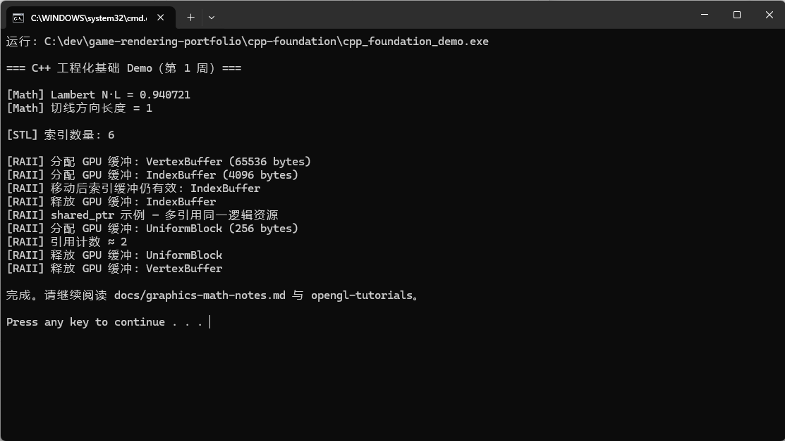

# 许付成 · 游戏渲染方向作品集

面向 **游戏渲染开发（校招）** 的 C++ / OpenGL 学习与演示仓库。

## 演示

### 已运行：C++ 工程化 Demo（cpp-foundation）



- 本地构建：WinLibs + `scripts/一键编译-复制到Cdev.bat`（见 [docs/绕过VS-完整方案.md](docs/绕过VS-完整方案.md)）
- 输出含 **Lambert N·L**、**RAII / 智能指针** 等，对应光照与引擎资源管理入门

| 类型 | 链接 |
|------|------|
| 录屏（可选） | _待填：B 站或网盘 URL_ |
| 更多截图 | [cpp-foundation/screenshots/](cpp-foundation/screenshots/) |

### 进行中：OpenGL 主项目

**[MiniForwardRenderer](MiniForwardRenderer/)** — Blinn-Phong + Shadow Map + 后处理（源码在仓库，图形 Demo 待 MSYS2/VS 环境编译）。

> 首次上架 GitHub 请按 [docs/GITHUB-上手指南.md](docs/GITHUB-上手指南.md) 逐步操作。

## 仓库结构

| 目录 | 说明 |
|------|------|
| [cpp-foundation/](cpp-foundation/) | 第 1 周：C++ 工程化与基础练习（CMake） |
| [docs/](docs/) | 图形学数学笔记、学习路线、面试题 |
| [opengl-tutorials/](opengl-tutorials/) | 第 2 周：OpenGL 入门 Demo（5 个） |
| [MiniForwardRenderer/](MiniForwardRenderer/) | 第 3 周：前向渲染小项目（光照 + Shadow Map + 后处理） |
| [career/](career/) | 双轨简历、Offer 评分、18 月路线图、每周反思 |
| [docs/career-roadmap-18m.md](docs/career-roadmap-18m.md) | 长期发展方向与作品集里程碑 |

## 环境要求

- Windows 10/11
- [Visual Studio 2022](https://visualstudio.microsoft.com/)（含「使用 C++ 的桌面开发」）
- [CMake](https://cmake.org/download/) 3.20+（安装时勾选 **加入 PATH**）
- Git

**若 cmd 提示「cmake 不是内部或外部命令」**：见 [docs/WINDOWS-环境安装.md](docs/WINDOWS-环境安装.md)。

**若 Visual Studio 安装器一直 0 B（热点也不行）**：**不要继续等 VS**，改看 [docs/绕过VS-完整方案.md](docs/绕过VS-完整方案.md)，用 `scripts/build-cpp-foundation-mingw.bat`。

## 一键构建（Windows 推荐）

在资源管理器中双击（需先装好 VS2022 + CMake）：

- [scripts/build-cpp-foundation.bat](scripts/build-cpp-foundation.bat) — 先跑通这个
- [scripts/build-mini-renderer.bat](scripts/build-mini-renderer.bat) — 主项目窗口

## 快速构建

```powershell
cd game-rendering-portfolio
cmake -B build -S .
cmake --build build --config Release
```

单独构建子项目：

```powershell
cmake -B build-cpp -S cpp-foundation
cmake --build build-cpp --config Release

cmake -B build-gl -S opengl-tutorials
cmake --build build-gl --config Release

cmake -B build-mini -S MiniForwardRenderer
cmake --build build-mini --config Release
```

运行 MiniForwardRenderer（构建后）：

```powershell
.\build-mini\MiniForwardRenderer\Release\MiniForwardRenderer.exe
```

## 学习记录

- 第 1 周：C++ RAII / 智能指针 / CMake；Games 101 前几讲笔记见 [docs/graphics-math-notes.md](docs/graphics-math-notes.md)
- 第 2 周：LearnOpenGL 跟敲，见 `opengl-tutorials/README.md`
- 第 3 周：MiniForwardRenderer 架构见项目 README
- 第 4 周：投递材料见 [career/](career/)
- 长期：方向试验与首份工作选择见 [docs/career-roadmap-18m.md](docs/career-roadmap-18m.md)

## 许可

个人学习与校招作品，代码可自由参考，请注明出处。
