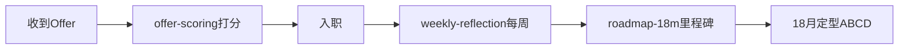

# 求职分轨策略（长期版）

> 落实「保留选择权」：双简历 + 分比例投递 + Offer 评分 + 每周反思。

## 文件索引

| 文档 | 作用 |
|------|------|
| [resume-rendering.md](resume-rendering.md) | 冲游戏渲染 / 图形初级 |
| [resume-backend.md](resume-backend.md) | 冲 Java 后端（保底） |
| [offer-scoring.md](offer-scoring.md) | 多 offer 对比打分 |
| [weekly-reflection.md](weekly-reflection.md) | 18 个月方向试验日记 |
| [career-roadmap-18m.md](../docs/career-roadmap-18m.md) | 作品集 6/12/18 月里程碑 |
| [apply-checklist.md](apply-checklist.md) | 单次投递清单 |

## 投递比例（默认）

可根据生存压力调整，总和 100%：

| 轨道 | 比例 | 简历 | 典型岗位关键词 |
|------|------|------|----------------|
| 游戏程序 | 40% | 渲染版（意向可写客户端） | 游戏客户端、Unity、UE、C++ |
| 渲染/图形 | 30% | 渲染版 | 渲染、图形、Shader、引擎 |
| 后端 | 25% | 后端版 | Java、Spring、后端开发 |
| 测试/测开 | 5% | 后端版或测试版 | 测试开发、QA、自动化 |

**规则**：同一公司同一批次只投 **一个** 意向，避免 HR 系统重复简历冲突。

## 首份工作优先级（回顾）

1. 游戏公司 · 客户端 / 引擎工具 / 图形初级  
2. 游戏公司 · 测开 / 带自动化的 QA  
3. 互联网 · 规范团队 Java 后端  
4. 慎选：纯手工 QA、无成长外包后端  

## 入职后流程

## 跟踪表（可复制）

| 公司 | 岗位 | 简历版本 | 投递日 | 状态 | Offer加权分 |
|------|------|----------|--------|------|-------------|
| | | 渲染/后端 | | | |
