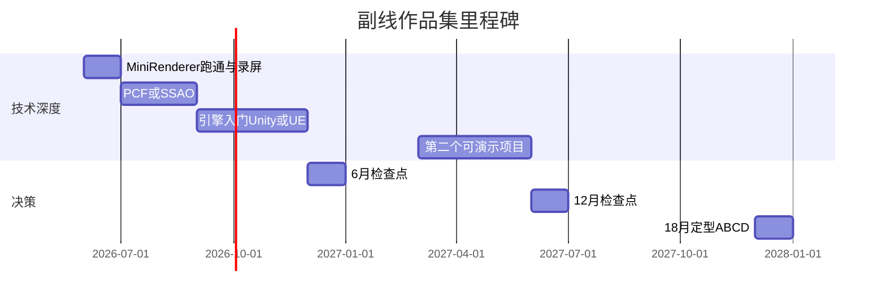

# 18 个月职业发展路线图（作品集 + 方向试验）

> 配合「主收入线 + 副线作品集」策略。起点：首份工作入职或 2026 届校招季开始，可按实际日期整体平移。

## 总览



| 阶段 | 时间 | 副线目标 | 决策信号 |
|------|------|----------|----------|
| M0～M6 | 0～6 月 | 跑通 MiniForwardRenderer；加 PCF **或** SSAO；GitHub + 2 分钟录屏 | 能白板讲清管线 → **分支 A 仍可行** |
| M6～M12 | 6～12 月 | Unity **或** UE 入门（二选一）；读官方渲染/Shader 文档 1 套 | 不排斥引擎工作流 → 跳槽优先 **游戏公司** |
| M12～M18 | 12～18 月 | 第二个项目上线；结合 [weekly-reflection](../career/weekly-reflection.md) 选型 | 见下方「18 月定型表」 |

---

## 0～6 月：夯实渲染 Demo（分支 A 门票）

### 必做

- [ ] `MiniForwardRenderer` Release 构建通过，README 含架构图与截图
- [ ] 推送至公开 GitHub，链接写入简历
- [ ] 录制演示视频（阴影 + 后处理 + FPS 可见）

### 技术二选一（至少完成 1 项）

| 选项 | 内容 | 简历可写 |
|------|------|----------|
| **PCF** | Shadow Map 3×3 软阴影采样 | 「缓解阴影锯齿」 |
| **SSAO** | 屏幕空间环境光遮蔽 Pass | 「增强场景体积感」 |

### 学习并行

- Games 101 看完前 8 讲
- LeetCode 每周 ≥ 3 题（见 [leetcode-plan.md](../career/leetcode-plan.md)）

### 6 月检查点（自问）

1. 能否 **15 分钟** 讲完 Shadow → Lighting → Post 三 Pass？
2. 主岗/求职是否已有 **游戏程序类** 面试或 offer？
3. 若 0 渲染相关反馈：加大 **游戏客户端** 投递，勿停副线

---

## 6～12 月：引擎接触（分支 A/B 跳板）

### 引擎路径（二选一，不要两个都浅）

#### 路径 U：Unity（上手快）

- [ ] 完成官方「3D 入门」或同等教程
- [ ] URP 下 1 个自定义 Lit Shader 或 Renderer Feature 实验
- [ ] 小场景：材质 + 简单后处理 Volume
- **产出仓库目录建议**：`unity-urp-lab/`（可后续新建）

#### 路径 E：Unreal（更贴大厂渲染 JD）

- [ ] 安装 UE5，跑通第三人称模板
- [ ] 阅读「渲染管线 / Lumen 概念」文档（不要求全懂）
- [ ] 改 1 个 Material 或 Post Process 参数并录屏说明
- **产出仓库目录建议**：`unreal-notes/`（笔记 + 截图即可，不必大项目）

### 12 月检查点

| 信号 | 建议动作 |
|------|----------|
| 副线 > 主岗成就感，Demo 能讲透 | 下阶段主攻 **A 渲染** 跳槽/转岗 |
| 更喜欢玩法、UI、系统逻辑 | 定型 **B 客户端**，渲染作特长 |
| 主岗后端顺利，图形停滞 > 2 月 | 明确 **C 后端** 或强制恢复副线冲 **A** |
| 主岗以手工测试为主、很少写代码 | 评估 **D**，或换岗/内部转测开 |

---

## 12～18 月：第二个可演示项目（差异化）

在以下 **任选 1 个** 做到可演示 + README + 录屏（约 2～4 周全职等价工作量）：

| 项目 | 技术栈 | 适合分支 | 难度 |
|------|--------|----------|------|
| **PBR 单材质** | OpenGL + 金属/粗糙度贴图 | A | 中 |
| **GPU Instancing 草地/立方体** | OpenGL 实例化 + 性能对比 FPS | A/B | 中 |
| **简化 Compute / SSBO 粒子** | OpenGL 4.3+ 或 Vulkan 入门 | A | 高 |
| **Unity 小型玩法 + 自定义 Shader** | Unity URP | B → A | 中 |
| **自动化测试工具** | Python/C++ + 游戏日志解析 | D → 测开 | 中低 |

### 推荐组合（保留选择权）

- **冲 A**：PBR 或 Instancing（仍用 C++/OpenGL，与 Mini 项目同仓库系列）
- **冲 B**：Unity 小玩法 + Shader
- **冲 D**：测试工具 + 继续 LeetCode

### 18 月定型表

| 分支 | 含义 | 满足 ≥ 3 条即可定型 |
|------|------|---------------------|
| **A** 渲染 | 游戏/引擎图形程序 | ②④⑤⑥ |
| **B** 客户端 | 游戏玩法/系统程序 | ①③⑤ |
| **C** 后端 | 互联网业务后端 | ①⑦⑧ |
| **D** QA/测开 | 质量与自动化专家 | ⑨⑩ |

**每周反思字段编号**（见 [weekly-reflection.md](../career/weekly-reflection.md)）：

1. 写业务需求有成就感  
2. 调 Shader/画质有成就感  
3. 做系统/玩法逻辑有成就感  
4. 副线图形项目本周有进展  
5. 解决性能/卡顿问题有成就感  
6. 愿意为主岗加班牺牲副线（是=偏主岗定型）  
7. 主岗以 Java/SQL/接口为主  
8. 对微服务/架构设计有兴趣  
9. 挖 Bug、写用例有成就感  
10. 写测试脚本/工具有成就感  

---

## 与主业的时间预算

| 主岗类型 | 建议副线每周小时 | 风险 |
|----------|------------------|------|
| 游戏客户端 / 引擎 | 6～8h | 低，与副线协同 |
| Java 后端 | 8～10h | 中，需自律 |
| 纯手工 QA | 10h+ 或先换岗 | 高，易滑向 D 且无代码成长 |

---

## 投递比例（18 个月内可动态调整）

| 阶段 | 游戏程序 | 渲染/图形 | 后端 | 测试/测开 |
|------|----------|-----------|------|-----------|
| 0～6 月 | 40% | 30% | 25% | 5% |
| 6～12 月 | 35% | 25% | 30% | 10% |
| 12～18 月 | 按定型分支集中 60%+ | — | — | — |

详细简历分轨见 [resume-rendering.md](../career/resume-rendering.md) 与 [resume-backend.md](../career/resume-backend.md)。

---

## 里程碑完成记录

复制到个人笔记或在本文件底部勾选：

```
M6  完成日期：____  PCF/SSAO：____  6月检查：通过 / 未通过
M12 完成日期：____  引擎路径：Unity / UE  12月检查：A/B/C/D 倾向
M18 完成日期：____  第二项目：____  定型分支：A / B / C / D
```
